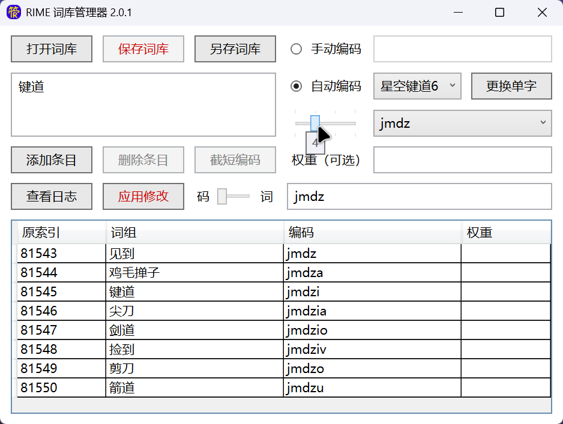

# RIME 词库管理器

一个轻量级 GUI 应用程序，用于交互式维护 RIME 输入法的词库。
利用严格的官方格式约束和直观的表格界面，减少错误并提高效率。
提供基于单字词库的词组自动编码功能以及可导出的操作日志。

## 功能特点

- 🔒 安全保障：严格遵循 [RIME 官方词库规范](https://github.com/rime/home/wiki/RimeWithSchemata)
- 🤖 自动编码：基于单字词库，按两笔、五笔等规则为词组编码
- 📝 日志记录：追溯所有修改操作，支持导出
- 🚀 极致性能：编码前缀搜索、字词精确搜索，百万条目迅速响应

## 使用方法

### 系统要求：Windows 10+

### 运行依赖：[.NET 10.0 运行时](https://dotnet.microsoft.com/download/dotnet/10.0)

### 使用步骤

1. 下载 [最新版本发布包](https://github.com/GarthTB/RimeDictManager/releases/latest) 并解压
2. 运行 `RimeDictManager.exe`
3. 打开 RIME 词库文件（.dict.yaml）
4. 选择编码方案，加载单字词库以启用自动编码
5. 添加、删除、修改、截短编码
6. 查看并保存日志
7. 保存或另存词库

## 项目信息

- 地址：https://github.com/GarthTB/RimeDictManager
- 技术栈：.NET 10.0、WPF、C# 14.0、[CommunityToolkit.Mvvm](https://github.com/CommunityToolkit/dotnet)
- 作者：Garth TB | 天卜 <g-art-h@outlook.com>
- 许可证：[MIT 许可证](https://mit-license.org/)

### 免责声明：本程序为个人项目，不提供商业支持。使用前请备份词库文件。开发者不对因使用本程序而造成的任何数据损失负责。

## 版本日志

### 2.0.1 (20260123)：优化自动编码性能

### 2.0.0 (20260110)

**（严重）全面重构，纠正对非官方格式的错误支持。**
旧源码已封存至 Legacy 目录，旧发布文件已销毁。

- 改进：不再强制无重复项，支持无编码条目
- 新增：保存时的两种排序策略

### 1.1.0 (20250723)

- 修复：排序搜索结果导致选中项识别错误
- 新增：自动处理词库文件头
- 新增：有多个自动编码可选时，编码变红
- 新增：截短编码时引入编码空位的风险提示

### 1.0.0 (20250720)

- 使用 .NET 10.0 WPF，专注 Windows 单平台
- 使用 MVVM 架构，提升性能与可维护性
- 完善对其他输入法方案的支持

## 前身（废弃）

### [跨平台Rime词库管理器](https://github.com/GarthTB/RimeTyrant) (20240910 - 20240914)

- 使用 MAUI 框架，支持 Windows 和 Android
- 初步尝试支持其他输入法方案

### [词器清单版](https://github.com/GarthTB/RimeLibrarian) (20240622 - 20241110)：重构界面，提供表格以简化操作

### [词器v2](https://github.com/GarthTB/JDLibManager) (20240605 - 20240620)：改用 .NET 6.0 WPF

### [词器](https://github.com/GarthTB/CiQi) (20230513 - 20231223)：使用 WinForms，专用于星空键道6
